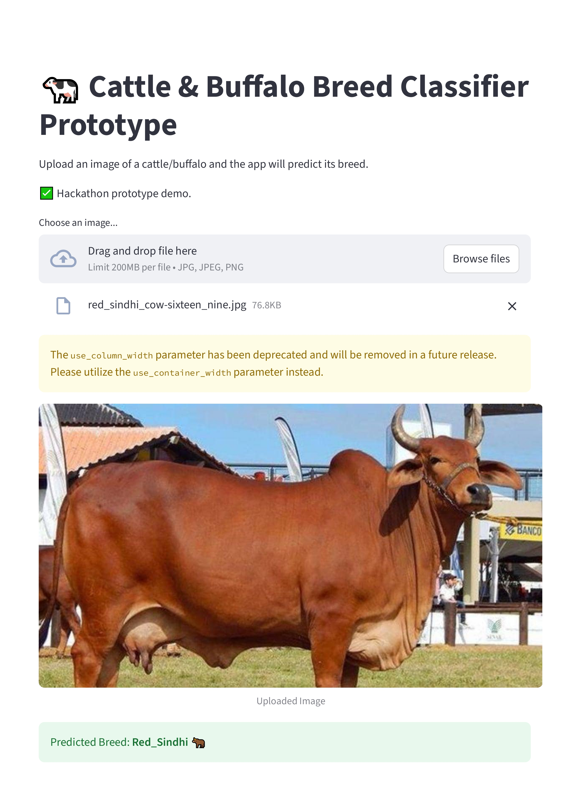

Indian Bovine Breed Classifier (Prototype)


Problem Statement
**SIH25004** – *Image-based breed recognition for cattle and buffaloes of India*.


Proposed Solution
We built an **AI-powered prototype** that can classify **Indian cattle & buffalo breeds** from images.  
This system can:
- Reduce manual errors in livestock breed identification.  
- Improve datasets for research and policymaking.  
- Assist during BPA registration with real-time suggestions.  


Features
- Upload an image of cattle or buffalo.  
- Get instant prediction of breed with confidence score.  
- Interactive **Streamlit web interface**.  
- Trained on Indian bovine datasets (prototype stage).  


Tech Stack
- **Python**  
- **TensorFlow / Keras**  
- **Streamlit**  
- **NumPy, Pillow**  


Installation & Usage

1] Clone this repository
```bash
git clone (https://github.com/Danish-1987/SIH-bovine-prototype)
cd SIH-bovine-prototype
```

2] Install dependencies
```bash
pip install -r requirements.txt
```

3] Run the Streamlit app
```bash
python -m streamlit run app.py

```


Dataset
- Source: [Kaggle – Indian Bovine Breeds]
- Classes include multiple **Indian cattle and buffalo breeds**.  
- Dataset will be expanded further to improve accuracy.  


Demo (Prototype UI)




Team
**Name:** Code Blue 

**Category:** Agriculture, Food Tech & Rural Development  


Note
This is a **prototype demo** for the internal hackathon.  
Final accuracy and production-level deployment will require:
- Larger datasets  
- Model fine-tuning  
- Additional validation  
